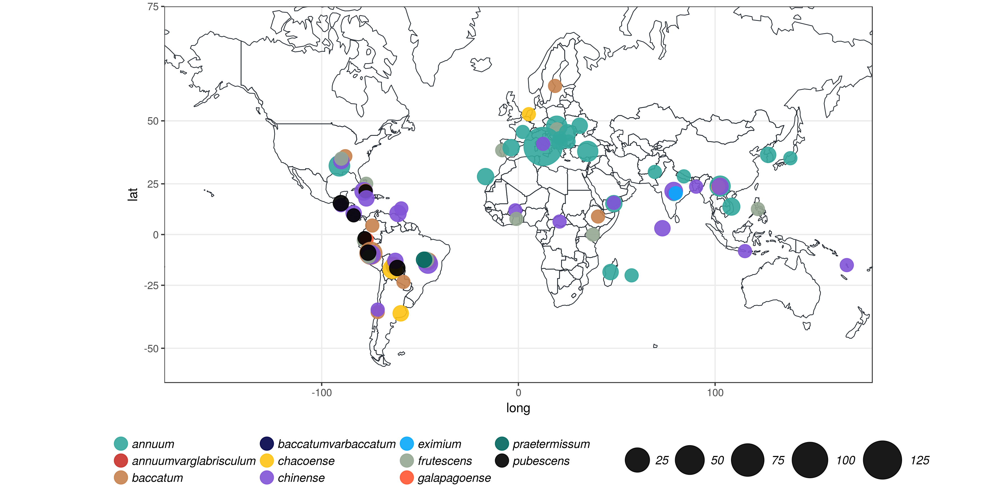

### our collection 

### Genomic diversity of the *Capsicum* genus at 746k variable sites.

**Summary of the sample used in this study.**
 A species was included in a specific analysis based on the number of accessions avaiable. Horizontal lines mark clusters of species used in different analyses.

|           Species           | # of diploid accessions  |     Type     |
|:---------------------------:|:------------------------:|:------------:|
|          C. annuum          |            220           | domesticated |
|         C. chinense         |            62            | domesticated |
|  C. baccatum (varpendulum)  |            39            | domesticated |
|        C. frutescens        |            14            | domesticated |
|         C. chacoense        |            13            |     wild     |
|         C.pubescens         |            13            | domesticated |
| C. annuum var glabriusculum |             5            |     wild     |
|       C. praetermissum      |             3            |     wild     |
|   C. baccatum var baccatum  |             2            | domesticated |
|       C. galapagoense       |             1            |     wild     |
|          C.eximium          |             1            |     wild     |

### Population structure of *Capsicum* reveals strong subdivisions with little or no admixiture among species.

**Population structure of the *Capsicum* species derived from 746k genome variants.**
a)Phylogenetic reconstruction of the relationship between the accessions. With a few exceptions, clusters corrispond to species.
b)Principal component analysis. The first two components separate the three main domesticated species. The third and the fourth components separate *C. pubescens* and *C. chacoense* between them and from the cluster of domesticated species.
c)Model based admixture analysis in the hypothesis of seven clusters. With the exceptions of few admixed or misplaced individuals, clusters to corrispond to species and within *C. annuum* is possible to observe two groups with distinct genetic features.
  

### In sight into *C. annuum* fruit variability from high resolution phenotyping.

**Graphic rapresentation of the phenotypes measured.**

**Figure 5.**

### Genetics of fruit in *C. annuum*.

**Results of the genome-wide association anlysis.**
a)We identified eight variants at four loci on three chromosomes, significant associated with seven traits. Circles represent association between one genetic variant and one trait. Colors distingish phenotype.
b)Cluster of phenotype determining whether fruits are pointed or squared.
c)Cluster of phenotypes determining if fruits are circular or elongated.

**Loci significantly associated with phenotypes related to fruit shape with genome-wide significance.**
Min/Maj = minor and major alleles; MAF = Minor Allele Frequency; β = Coefficient describing the effect size of the marker in the univariate linear model of association; SE = Standard Error of β; p-value = genome-wide Bonferroni corrected p-value for association.   

| Chr:position   Genomic region |          Nearest gene (kb)           Min/Maj Alleles |  MAF             Phenotype          |   β       SE  |  p-value |
|:------------:|:--------------:|:----------------------------------:|:---------------:|:----:|:----------------------------:|:-----:|:-----:|:--------:|
|  3:183386147     CA03g16080   |                  0                         C/T       | 0.13             Circular           |  0.10   0.016 | 1.36E-08 |
|                               |                                                      |                  Ellipsoid          |  0.03   0.005 | 1.58E-10 |
|                               |                                                      |        Fruit Shape Index External I |  0.91   0.145 | 4.93E-09 |
|                               |                                                      |              Lobedness Degree       | 16.97   2.449 | 1.38E-10 |
|  10:28759675     Intergenic   |          CA10g04730 (-911)                 T/C       | 0.36        Distal Angle Macro      | 18.47   2.962 | 4.97E-09 |
|  10:28759685     Intergenic   |          CA10g0473 (-910)                  T/G       | 0.36        Distal Angle Macro      | 18.47   2.962 | 4.97E-09 |
|  10:33533810     Intergenic   | CA10g05040 (166) CA10g05050 (-156)         C/T       | 0.22               Ovoid            | -0.08   0.012 | 8.87E-10 |
|                               |                                                      |          Proximal Fruit Blockiness  | -0.12   0.018 | 1.91E-10 |
|  10:33533831     Intergenic   | CA10g05040 (167) CA10g05050 (156)          T/A       | 0.22               Ovoid            | -0.08   0.012 | 8.87E-10 |
|                               |                                                      |          Proximal Fruit Blockiness  | -0.12   0.018 | 1.91E-10 |
|  10:33534094     Intergenic   | CA10g05040 (169) CA10g05050 (-156)         T/A       | 0.22               Ovoid            | -0.08   0.012 | 8.87E-10 |
|                               |                                                      |          Proximal fruit Blockiness  | -0.12   0.018 | 1.91E-10 |
|  10:33557960     Intergenic   | CA10g05040 (408) CA10g05050 (-132)         C/G       | 0.1                Ovoid            | -0.15   0.024 | 5.43E-09 |
|                               |                                                      |          Proximal fruit Blockiness  | -0.24   0.036 | 4.04E-10 |
|  11:18204293     Intergenic   | CA11g04570 (849) CA11g04580 (-892)         T/A       | 0.06             Ellipsoid          |  0.04   0.006 | 4.39E-09 |

### A non-synonymous change in the *Longifolia 1-like* gene is associated with variance in *C. annuum* fruit elongation

**Figure 7.**
a)Locus zoom plot in a region of ±2Mb surrounding the non-synonymous mutation (3:183386147) in the gene *Longifolia 1-like* (CA03g16080) showing that the 3:183386147 variant is the only one reaching a genome-wide significant thereshold for genetic association in a region containing twenty-six genes. Color gradient indicate linkage desequilibrium mesuared ad r².
b)The predict genic structure of *Langifolia 1-like* (CA03g16080).
c)Predict protein structure for *Langifolia 1-like*.
 

**Table 3.**

|     Species (n)    | CTC (Leu) | TTC (Phe) |
|:------------------:|-----------|-----------|
|   C.annuum (412)   |    0.23   |    0.76   |
| C. frutescens (28) |    0.02   |    0.98   |
|  C. chinense (90)  |    0.03   |    0.97   |
|  C. baccatum (72)  |     0     |     1     |
|  C. chacoense (26) |     0     |     1     |
|  C. pubescens (26) |     0     |     1     |
